# Git实战

听故事顺便学git，可能是全世界最好玩的git教程。

## 第一章 快速入门

### 1.1 什么是Git

Git是一个分布式的版本控制软件。

- 软件，类似于QQ、office、dota等安装到电脑上才能使用的工具。
- 版本控制，类似于毕业论文、写文案、视频剪辑等，需要反复修改和保留原历史数据。
- 分布式
  - 文件夹拷贝
  - 本地版本控制
  - 集中式版本控制
  - 分布式版本控制

### 1.2 为什么要做版本控制

要保留之前所有的版本，以便回滚和修改。

### 1.3 安装git

详见：<https://git-scm.com/book/zh/v2/%E8%B5%B7%E6%AD%A5-%E5%AE%89%E8%A3%85-Git>


## 第二章  “东北热”创业史

### 2.1 第一阶段：单枪匹马开始干

想要让git对一个目录进行版本控制需要以下步骤：

- 进入要管理的文件夹

- 执行初始化命令

  ```
  git init
  ```

- 管理目录下的文件状态

  ```
  git status
  
  注：新增的文件和修改过后的文件都是红色
  ```

- 管理指定文件（红变绿）

  ```
  git add 文件名
  git add .
  ```

- 个人信息配置：用户名、邮箱 【一次即可】

  ```
    git config --global user.email "you@example.com"
    git config --global user.name "Your Name"
  ```

- 生成版本

  ```
  git commit -m '描述信息'
  ```

- 查看版本记录

  ```
  git log 
  ```

### 2.2 第二阶段：拓展新功能

```
git add 
git commit -m '短视频'
```


### 2.3 第三阶段：“约饭事件”

- 回滚至之前版本

  ```
  git log 
  git reset --hard 版本号
  ```

- 回滚之之后版本

  ```
  git reflog 
  git reset --hard 版本号
  ```

### 2.4 小总结

```
git init 
git add 
git commit 
git log 
git reflog 
git reset --hard 版本号
```

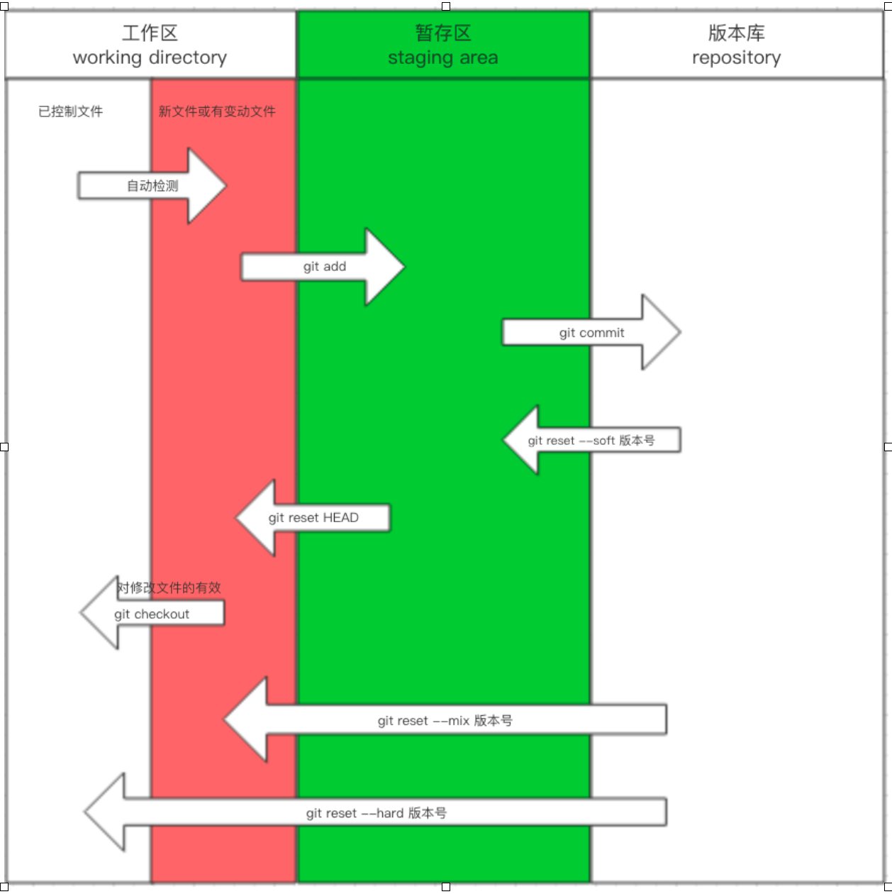


### 2.5 第四阶段：商城&紧急修复bug

#### 2.5.1  分支

分支可以给使用者提供多个环境的可以，意味着你可以把你的工作从开发主线上分离开来，以免影响开发主线。 
 情景1：多个提交和为1个提交
   git rebase -i HEAD~2
    git rebase -i 版本号（哈希值）
  情景2：

#### 2.5.2 紧急修复bug方案

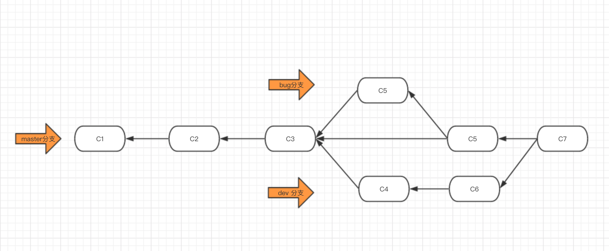

#### 2.5.3 命令总结

- 查看分支

  ````
  git branch
  ````

- 创建分支

  ```
  git branch 分支名称
  ```

- 切换分支

  ```
  git checkout 分支名称
  ```

- 分支合并（可能产生冲突）

  ```
  git merge 要合并的分支
  
  注意：切换分支再合并
  ```

- 删除分支

  ```
  git branch -d 分支名称
  ```

#### 2.5.4 工作流

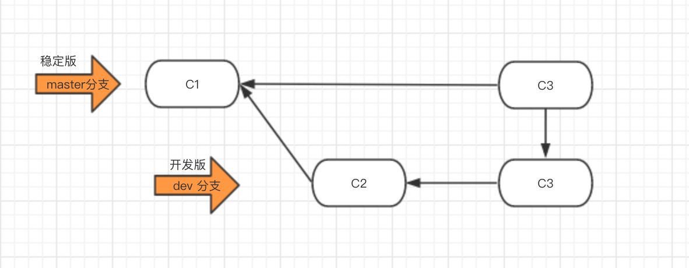


### 2.6 第五阶段：进军三里屯

有钱之后就要造呀，一个人在三里屯买了一层楼做办公室。

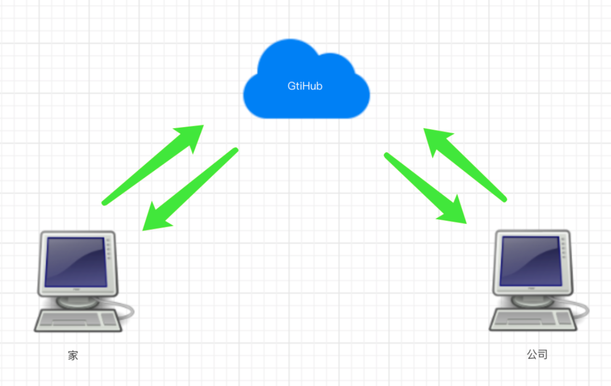

#### 2.6.1 第一天上班前在家上传代码

首先，需要注册github账号，并创建远程仓库，然后再执行如下命令，将代码上传到github。

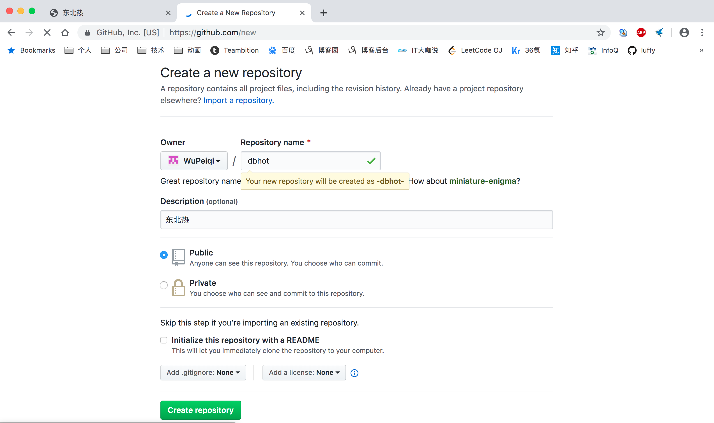

```
1. 给远程仓库起别名
	git remote add origin 远程仓库地址
2. 向远程推送代码
	git push -u origin 分支
```

#### 2.6.2 初次在公司新电脑下载代码

```
1. 克隆远程仓库代码
	git clone 远程仓库地址 (内部已实现git remote add origin 远程仓库地址)
2. 切换分支
	git checkout 分支
```

在公司下载完代码后，继续开发

```
1. 切换到dev分支进行开发
	git checkout dev 
2. 把master分支合并到dev [仅一次]
	git merge master
3. 修改代码
4. 提交代码
	git add . 
	git commit -m 'xx'
	git push origin dev 
```

#### 2.6.3 下班回到家继续写代码

```
1. 切换到dev分支进行开发
	git checkout dev 
2. 拉代码
	git pull origin dev 
3. 继续开发

4. 提交代码
	git add . 
	git commit -m 'xx'
	git push origin dev 
```

#### 2.6.4 到公司继续开发

```
1. 切换到dev分支进行开发
	git checkout dev 
2. 拉最新代码(不必再clone，只需要通过pull获取最新代码即可)
	git pull origin dev 
3. 继续开发

4. 提交代码
	git add . 
	git commit -m 'xx'
	git push origin dev 

```

开发完毕，要上线

```
1. 将dev分支合并到master，进行上线
	git checkout master
	git merge dev 
	git push origin master
2. 把dev分支也推送到远程
	git checkout dev
	git merge master 
	git push origin dev 
```

#### 2.6.5 在公司约妹子忘记提交代码

```
1. 拉代码
	git pull origin dev 
2. 继续开发

3. 提交代码
	git add . 
	git commit -m 'xx'

注：忘记push了
```

#### 2.6.6 回家继续写代码

```
1. 拉代码，发现在公司写的代码忘记提交...
	git pull origin dev 
	
2. 继续开发其他功能
	
3. 把dev分支也推送到远程
	git add . 
	git commit -m 'xx'
	git push origin dev 
```

#### 2.6.7 到公司继续写代码

````
1. 拉代码，把晚上在家写的代码拉到本地(有合并、可能产生冲突)
	git pull origin dev 
	
2. 如果有冲突，手动解决冲突
	
3. 继续开发其他功能
	
4. 把dev分支也推送到远程
	git add . 
	git commit -m 'xx'
	git push origin dev 
````

#### 2.6.8 其他

```
git pull origin dev
等价于
git fetch origin dev
git merge origin/dev 
```

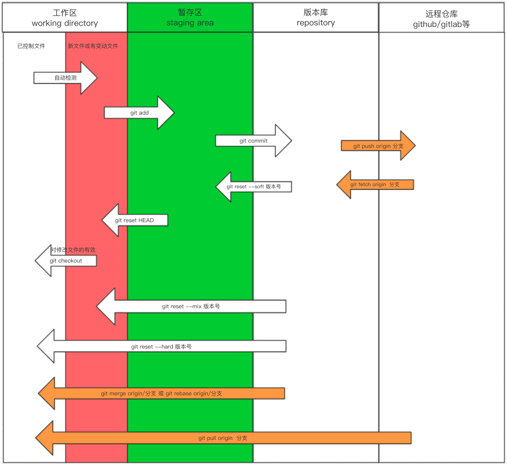


#### 2.6.9 rebase的作用？

rebase可以保持提交记录简洁，不分叉。


#### 2.6.9 快速解决冲突

1. 安装beyond compare 
    
2. 在git中配置

   ```
   git config --local merge.tool bc3
   git config --local mergetool.path '/usr/local/bin/bcomp'
   git config --local mergetool.keepBackup false
   ```
只在本项目生效
3. 应用beyond compare 解决冲突

   ```
   git mergetool 
   ```

### 2.7 小总结

- 添加远程连接（别名）

  ```
  git remote add origin 地址
  ```

- 推送代码

  ```
  git push origin dev 
  ```

- 下载代码

  ```
  git clone 地址
  ```

- 拉取代码

  ```
  git pull origin dev 
  等价于
  git fetch origin dev
  git merge origin/dev 
  ```

- 保持代码提交整洁（变基）

  ```
  git rebase 分支
  ```

- 记录图形展示

  ```
  git log --graph --pretty=format:"%h %s"
  ```


### 2.8 第六阶段：多人协同开发工作流


#### 2.8.1 创建项目&邀请成员

协同开发时，需要所有成员都可以对同一个项目进行操作，需要邀请成员并赋予权限，否则无法开发。github支持两种创建项目的方式（供多人协同开发）。

1. 合作者，将用户添加到仓库合作者中之后，该用户就可以向当前仓库提交代码。
   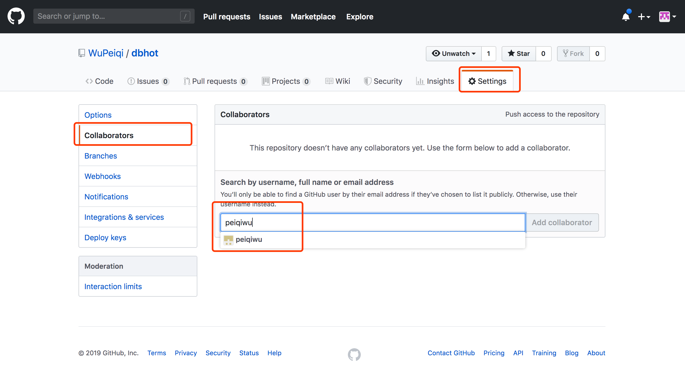

2. 组织，将成员邀请进入组织，组织下可以创建多个仓库，组织成员可以向组织下仓库提交代码。

   <div style="width:50%;float:left">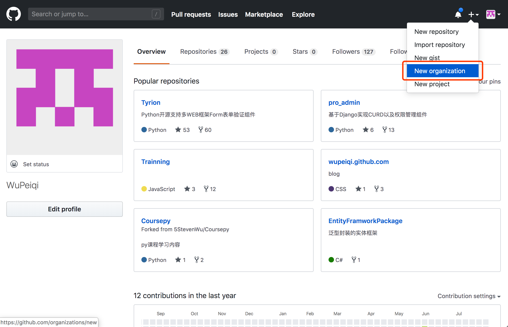</div>
   <div style="width:50%;float:left">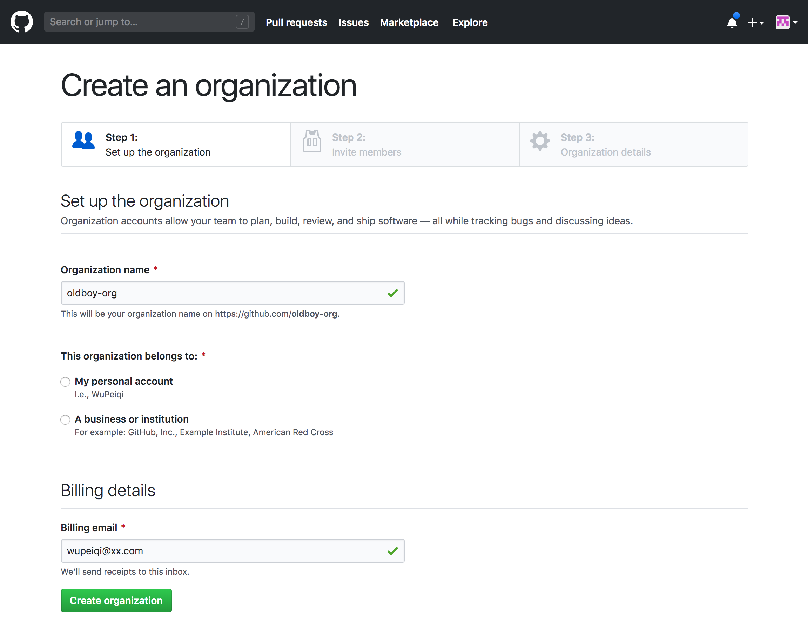</div>
   <div style="width:50%;float:left">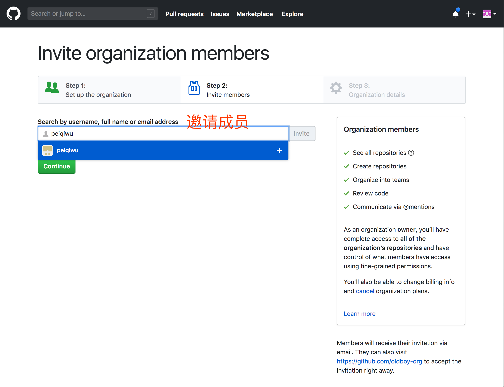</div>
   <div style="width:50%;float:left">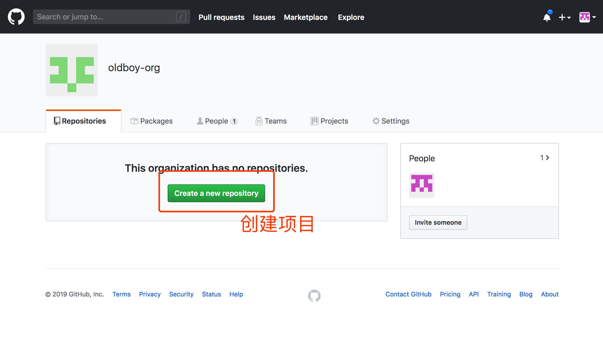</div>

##### 扩展：Tag标签管理

为了能清晰的管理版本，在公司不会直接使用commit来做版本，会基于Tag来实现：v1.0 、 v1.2 、v2.0 版本。

```
git tag -a v1.0 -m '版本介绍'        创建本地创建Tag信息
git tag -d v1.0                     删除Tag
git push origin  --tags             将本地tag信息推送到远程仓库
git pull origin  --tags             更新本地tag版本信息

git checkout v.10                   切换tag
git clone -b v0.1 地址               指定tag下载代码
```


#### 2.8.2 小弟开发

- 小弟注册Github 或 Gitlab账号

- 邀请小弟进入组织（默认对组织中的项目具有读权限）
  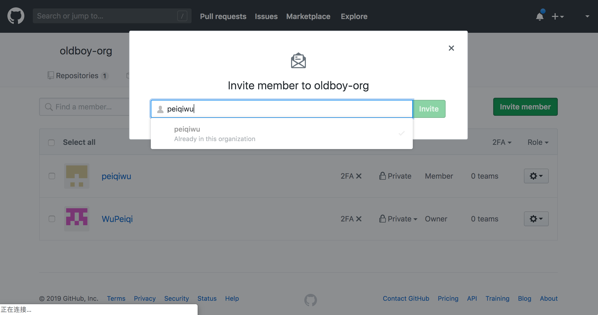

- 邀请小弟成为某项目的合作者

  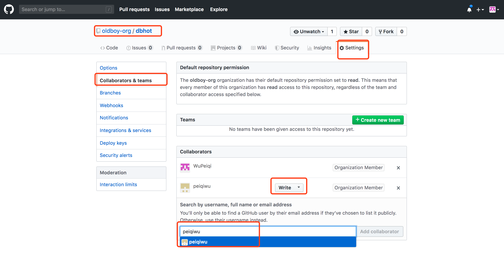

- 小弟在自己电脑上下载代码并开发

  ```
  git clone https://github.com/oldboy-org/dbhot.git
  cd dbhot
  git checkout dev
  git checkout -b dzz 
  写代码...
  
  git add .
  git commit -m '斗地主功能开发完成'
  git push origin ddz
  ```

#### 2.8.3 code review

1. 配置，代码review之后才能合并到dev分支。
   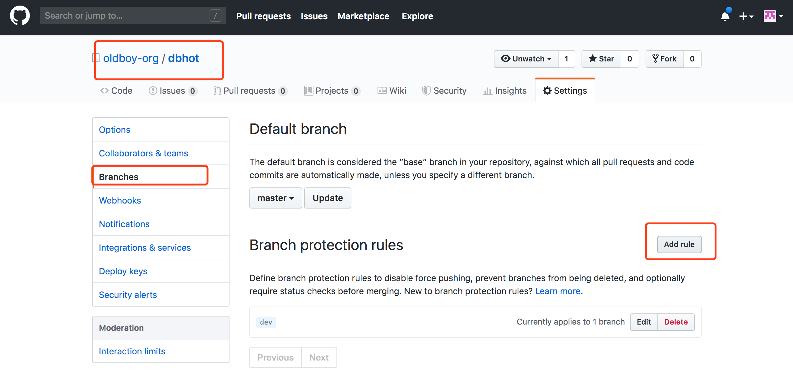
   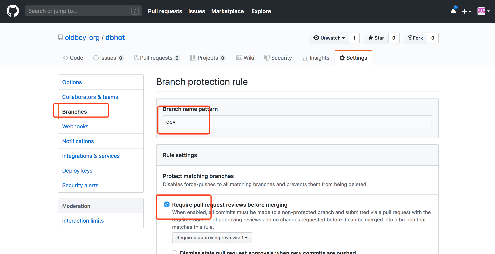
2. 小弟提交 code review申请
   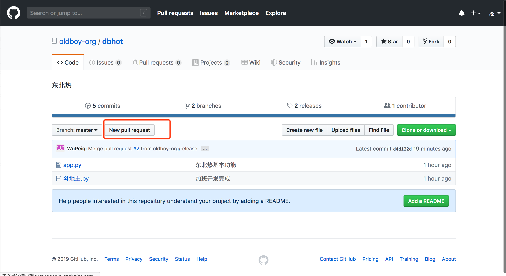
   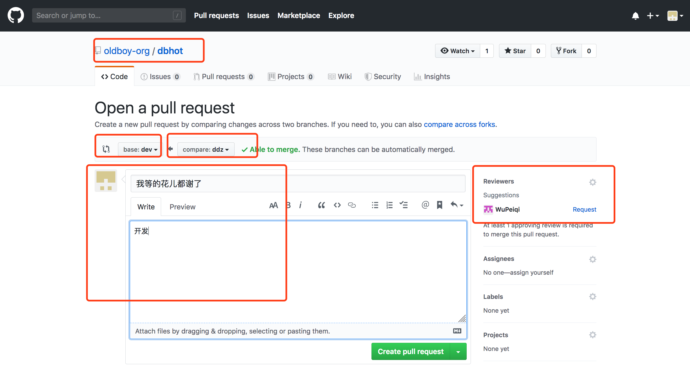
3. 组长做 code review
   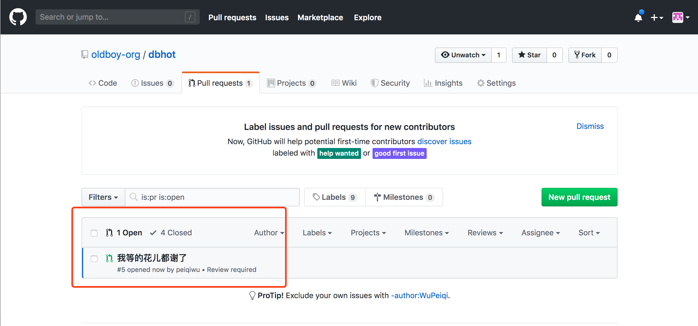
   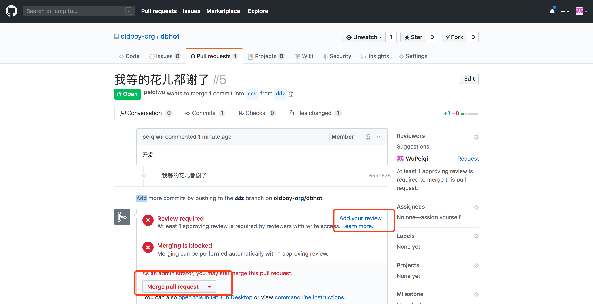

#### 2.8.4 提测上线（预发布）

由专门团队或团队leader执行以下步骤：

1. 基于dev分值创建release分值

   ```
   git checkout dev
   git checkout -b release
   ```

2. 测试等

3. 合并到master

   ```
   使用pull request
   或
   本地将release合并到master分支
   ```

4. 在master分支打tag

   ```
   git tag -a v2 -m '第二版 斗地主功能'
   git push origin --tags
   ```

5. 运维人员就可以去下载代码做上线了

   ```
   git clone -b v2 地址
   ```

   

### 2.9 第七阶段：给开源软件贡献代码

1. fork源代码
   将别人源代码拷贝到我自己的远程仓库。
2. 在自己仓库进行修改代码
3. 给源代码的作者提交 修复bug的申请（pull request）


## 第三章 其他

### 3.1 配置

- 项目配置文件：项目/.git/config

  ```
  git config --local user.name '武沛齐'
  git config --local user.email 'wupeiqi@xx.com'
  ```

- 全局配置文件:  ~/.gitconfig

  ```
  git config --global user.name 'wupeiq'
  git config --global user.name 'wupeiqi@xx.com'
  ```

- 系统配置文件：/etc/.gitconfig

  ```
  git config --system user.name 'wupeiq'
  git config --system user.name 'wupeiqi@xx.com'
  
  注意：需要有root权限
  ```

应用场景：

```
git config --local user.name '武沛齐'
git config --local user.email 'wupeiqi@xx.com'

git config --local merge.tool bc3
git config --local mergetool.path '/usr/local/bin/bcomp'
git config --local mergetool.keepBackup false

git remote add origin 地址 ，默认添加在本地配置文件中(--local)
```

### 3.2 免密码登录

- URL中体现

  ```
  原来的地址：https://github.com/WuPeiqi/dbhot.git
  修改的地址：https://用户名:密码@github.com/WuPeiqi/dbhot.git
  
  git remote add origin https://用户名:密码@github.com/WuPeiqi/dbhot.git
  git push origin master 
  ```

- SSH实现

  ```
  1. 生成公钥和私钥(默认放在 ~/.ssh目录下，id_rsa.pub公钥、id_rsa私钥）
     ssh-keygen
  2. 拷贝公钥的内容，并设置到github中。
  3. 在git本地中配置ssh地址
  	git remote add origin git@github.com:WuPeiqi/dbhot.git
  	
  4. 以后使用
  	git push origin master 
  ```

- git自动管理凭证

### 3.3 git忽略文件

让Git不再管理当前目录下的某些文件。
.gitignore文件，可以指定忽略的文件。

```
```
*.h
!a.h
files/
*.py[c|a|d]
```

更多参考：<https://github.com/github/gitignore>

### 3.4 github任务管理相关

- issues，文档以及任务管理。
- wiki，项目文档。

## 结课

感谢各位同学的关注和学习，希望git实战课程对你能够有所帮助，更多资源关注：

- 小猿圈    <www.apeland.cn>
- 路飞学城   <www.luffycity.com>
- 老男孩IT教育   <www.oldboyedu.com>


